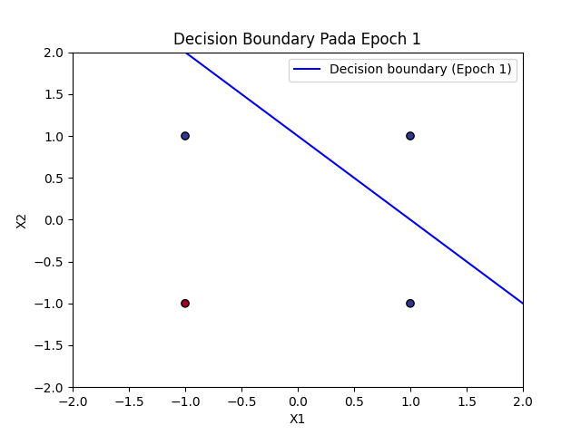
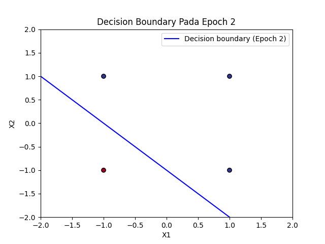
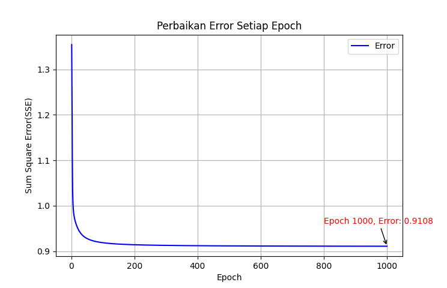

### Nama : Faqih Ardiansyah
### NIM : H1D024047
### Shift Lama : A
### SHift Baru : B

# Praktikum Kecerdasan Buatan - Jaringan Syaraf Tiruan (JST)

## 1. Landasan Teori

### Jaringan Syaraf Tiruan (JST)
Jaringan Syaraf Tiruan adalah paradigma pemrosesan informasi yang terinspirasi oleh sistem sel syaraf biologi (neuron) manusia dalam memproses informasi.JST memproses informasi melalui struktur terkecil yang disebut neuron, di mana hubungan antar neuron menyimpan bobot tertentu.

### Arsitektur Neuron
Setiap neuron menerima $n$ input $(x_1, x_2, ..., x_n)$ dengan bobot masing-masing $(w_1, w_2, ..., w_n)$ dan sebuah bobot bias $b$. Informasi tersebut dijumlahkan dan diproses melalui fungsi aktivasi untuk menentukan output jaringan:

$$y_{in} = b + \sum_{i=1}^{n} x_i w_i$$

## 2. Implementasi Model

### A. Perceptron (Masalah OR)
Perceptron adalah sistem pembelajaran terawasi yang memetakan input ke dalam label kelas output yang sesuai menggunakan jaringan berlayer tunggal (*single layer*)[cite: 249, 250]. Pada kasus ini, model digunakan untuk menyelesaikan masalah **OR** dengan target bipolar (-1 atau 1).

**Logika Pembaruan Bobot (Delta Rule):**
Pembaruan bobot dilakukan jika terjadi *error* berdasarkan persamaan:
$$\Delta w_i = \alpha(t_i - y_i) \cdot x_i$$
$$w_i = w_i + \Delta w_i$$

#### Hasil Visualisasi Perceptron:
| Epoch 1 | Epoch 2 | Epoch 3 |
| :---: | :---: | :---: |
|  |  |  |
| *Garis pemisah awal yang masih acak.* | *Model mulai menemukan garis pemisah yang tepat.* | *SSE mencapai 0, model konvergen.* |

### B. Backpropagation (Masalah XOR)
[cite_start]Masalah XOR tidak dapat diselesaikan dengan garis linier (Perceptron), sehingga membutuhkan *hidden layer* dan algoritma **Backpropagation**[cite: 486, 521]. [cite_start]Algoritma ini menggunakan perambatan mundur (*backward propagation*) untuk memperbaiki bobot berdasarkan respons output[cite: 487].

**Fungsi Aktivasi:**
Menggunakan fungsi *sigmoid bipolar* atau `tanh` untuk membatasi output antara -1 hingga 1:
$$y = \frac{1 - e^{-y_{in}}}{1 + e^{-y_{in}}}$$

#### Grafik Perbaikan Error:

*Grafik menunjukkan penurunan Sum Square Error (SSE) setiap epoch hingga mencapai target error atau batas maksimal epoch[cite: 550, 593].*

## 3. Output Program
* `HasilPerceptron.txt`: Log hasil perhitungan manual model Perceptron[cite: 315].
* `hasilBackpropagation.txt`: Log hasil perhitungan model Backpropagation[cite: 596].

## 4. Cara Menjalankan
1. Pastikan telah menginstal library yang diperlukan:
   ```bash
   pip install numpy matplotlib
   ```
2. Jalankan simulasi Perceptron:
   ```bash
   python Perceptron_or.py
   ```
3. Jalankan simulasi Backpropagation:
   ```bash
   python Backpropagation_xor.py
   ```